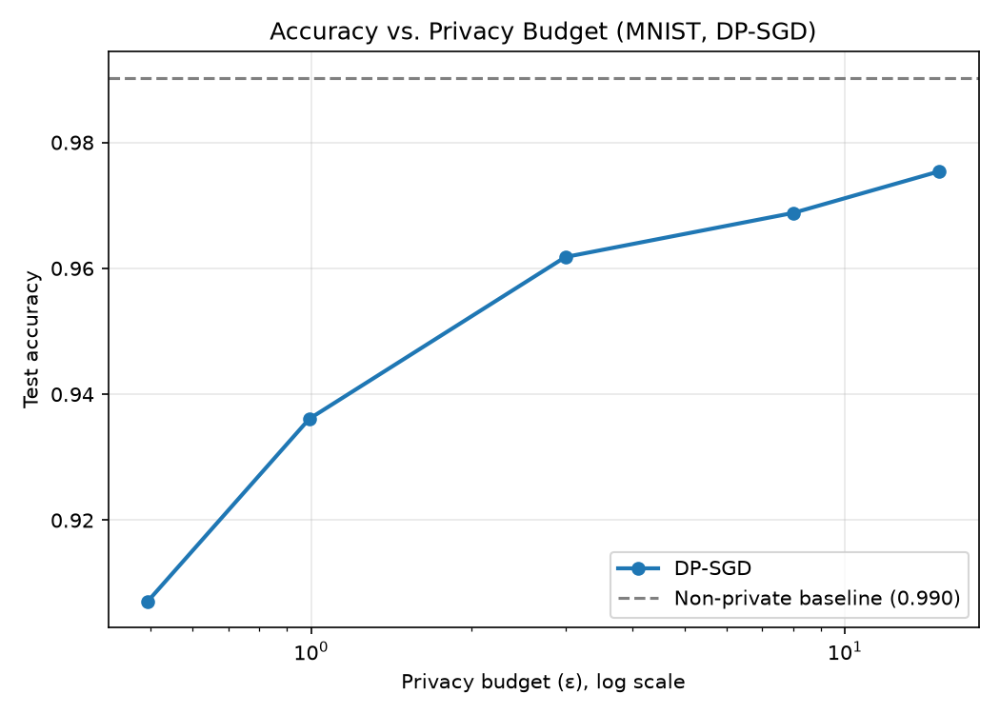
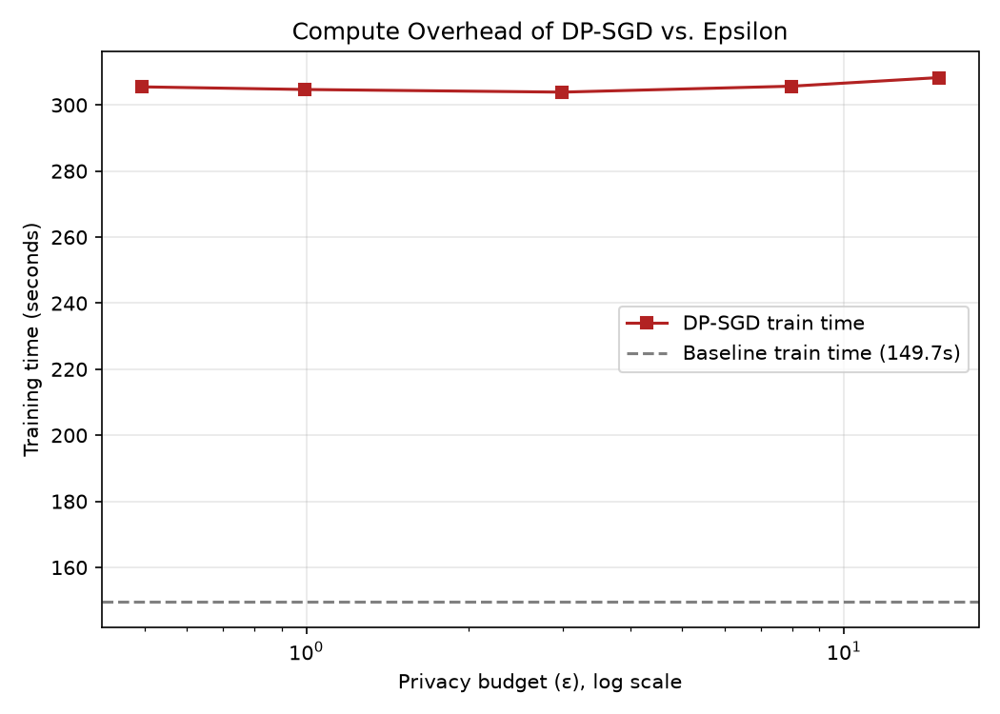

# Differential Privacy Experiments: Accuracy vs. Privacy Budget

Quantifies the accuracy trade-off of training a CNN with **DP-SGD** (via
[Opacus](https://opacus.ai/)) at different privacy budgets (ε), compared
against a non-private baseline, on MNIST.

## Why this exists

Differential privacy gives a formal, provable bound on how much any single
training example can influence a model's output — which matters whenever
training data includes anything sensitive (health records, financial
transactions, user behavior logs). But privacy isn't free: DP-SGD adds
per-sample gradient clipping and calibrated noise, which costs accuracy and
compute. This project measures that cost concretely rather than asserting it.

## Method

1. Train a small CNN (`SmallCNN` in `src/train.py`) on MNIST with plain SGD —
   this is the accuracy ceiling.
2. Train the same architecture with DP-SGD at a sweep of target ε values
   (default: 0.5, 1, 3, 8, 15), holding δ = 1e-5 fixed.
3. Opacus's `make_private_with_epsilon` back-solves the noise multiplier
   needed to hit each target ε over the full training run, using RDP
   (Rényi Differential Privacy) accounting.
4. Record final test accuracy, realized ε, noise multiplier, and wall-clock
   training time for every run.
5. Plot accuracy vs. ε and training-time overhead vs. ε.

Note on architecture: Opacus requires per-sample gradients, so `BatchNorm`
layers (which mix statistics across the batch) are replaced with `GroupNorm`.

## Setup

```bash
pip install -r requirements.txt
```

MNIST downloads automatically on first run via torchvision. If you're
running somewhere without internet access to the MNIST mirrors, set
`DP_DATASET=digits` to fall back to scikit-learn's bundled 8x8 digits
dataset (~1,800 samples) — useful for a fast, fully offline pipeline check,
though it's a much easier task and not what should be reported as your
final numbers.

## Usage

```bash
# Full sweep: baseline + DP-SGD at epsilon = 0.5, 1, 3, 8, 15
python src/train.py --epochs 10 --epsilons 0.5,1,3,8,15

# Just the baseline
python src/train.py --baseline-only --epochs 10

# Just DP runs at custom epsilons
python src/train.py --dp-only --epsilons 2,5,20 --epochs 10

# Generate plots from results/accuracy_vs_epsilon.csv
python src/plot_results.py
```

Key flags: `--batch-size`, `--lr`, `--delta`, `--max-grad-norm` (the
per-sample gradient clipping threshold — this is the main DP-SGD
hyperparameter besides ε/δ, and it interacts with the noise multiplier that
Opacus solves for).

## Results

| Run | Target ε | Realized ε | Noise multiplier | Test accuracy | Train time (s) |
|---|---|---|---|---|---|
| baseline | ∞ | — | — | 99.03% | 149.7 |
| dp_eps_0.5 | 0.5 | 0.494 | 1.6797 | 90.71% | 305.5 |
| dp_eps_1 | 1 | 0.992 | 1.0596 | 93.61% | 304.7 |
| dp_eps_3 | 3 | 2.993 | 0.6946 | 96.18% | 303.9 |
| dp_eps_8 | 8 | 7.994 | 0.5238 | 96.88% | 305.7 |
| dp_eps_15 | 15 | 14.999 | 0.4396 | 97.54% | 308.3 |



## Known limitations

- **ε alone is not a complete privacy story.** It bounds worst-case
  distinguishability under a specific adversary model (member vs.
  non-member of the training set); it doesn't capture attacks outside that
  model, data leakage through hyperparameters, or how ε composes across
  multiple releases of the same model.
- **Small-batch DP-SGD is noisy and unstable at low ε** — expect accuracy
  variance across seeds to be much higher for DP runs than for the
  baseline; a single run per ε value (as scaffolded here) is a
  demonstration of the trade-off, not a statistically rigorous estimate.
  Report mean ± std over multiple seeds if this goes into a portfolio
  writeup as a rigorous result.
- **This uses a specific accountant and clipping strategy** (Opacus's RDP
  accountant, per-sample clipping at a fixed norm). Different accountants
  (e.g., PRV) or adaptive clipping can shift the accuracy/ε curve for the
  same nominal ε.
- **No empirical validation of the privacy guarantee** — e.g., no
  membership inference attack was run to confirm that lower ε actually
  corresponds to lower empirical attack success. This is flagged as a
  natural extension in the project structure, not included by default.
- **MNIST is an easy, low-dimensional task.** The accuracy/ε trade-off
  curve looks more forgiving on MNIST than it would on a harder or
  higher-dimensional task — don't generalize the specific numbers here to
  other datasets.

## Project structure

```
dp-experiments/
├── README.md
├── requirements.txt
├── src/
│   ├── train.py           # baseline + DP-SGD sweep
│   └── plot_results.py    # accuracy/time vs epsilon plots
├── results/
│   ├── accuracy_vs_epsilon.csv
│   ├── accuracy_vs_epsilon.png
│   └── train_time_vs_epsilon.png
└── docs/
    └── methodology.md      # accounting details, DP-SGD background
```
